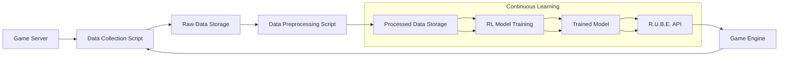

# R.U.B.E. - Reinforcement-based Universal Behavior Engine

## Introduction

R.U.B.E. (Reinforcement-based Universal Behavior Engine) is a revolutionary system designed to equip NPCs with intelligent and adaptive behaviors in games like Minecraft and GTA, utilizing the principles of Reinforcement Learning (RL). This project aims to create a framework that empowers NPCs with the ability to learn, adapt, and interact with the game environment in a truly dynamic and engaging way, surpassing traditional scripted AI approaches. 

## Vision

Imagine a world where NPCs are no longer predictable automatons but rather sentient entities capable of learning, adapting, and reacting to player actions in a truly dynamic and engaging way.  This is the vision of R.U.B.E., a system that aims to revolutionize the way we design and interact with NPCs in games, ushering in a new era of immersive and compelling gameplay experiences.

## Core Concepts

**Reinforcement Learning (RL):**

RL is a type of machine learning where an agent learns to interact with an environment by receiving rewards for performing actions that lead to desired outcomes. The agent's goal is to maximize its cumulative reward over time, learning through trial and error and adapting its strategy based on feedback from the environment.

**2. State:** The current state of the game environment, including the NPC's position, orientation, health, inventory, surrounding objects, and any relevant player information. This state representation captures the key elements that the NPC needs to understand its current situation. 

**3. Action:** An action that the NPC can take, such as moving, interacting with objects, using items, attacking, or engaging in specific game-related tasks. The action space defines the range of behaviors that the model can learn and execute. 

**4. Reward:** A numerical value assigned to an action based on its contribution to achieving the NPC's goal. A positive reward encourages the agent to repeat the action, while a negative reward discourages it. The reward function guides the learning process, shaping the NPC's behavior towards achieving desired outcomes.

**5. Model:** A neural network that learns to predict the optimal actions for a given state based on the reward function. The model improves its performance through training, refining its ability to make intelligent decisions within the game environment.

## R.U.B.E. Architecture

**Data Collection and Preprocessing:**

- **Data Collection Scripts:**  Scripts like `collect.py` interact with the game API, capturing data about the environment, player actions, and rewards. This data serves as the foundation for training the RL models.
- **Raw Data Storage:** Collected data is stored in structured formats (e.g., JSON) within the `/data/raw` directory, organized by game and version.
- **Data Preprocessing:** Scripts like `preprocess.py` clean, normalize, and annotate the data to prepare it for model training. This involves handling missing values, removing outliers, and ensuring consistency. 
- **Processed Data Storage:**  Processed data is stored in efficient formats (e.g., HDF5) within the `/data/processed` directory. This format optimizes data retrieval during model training.

**Model Development:**

- **Reward Function Design:**  Reward functions are carefully crafted to guide the RL agent towards desired behaviors. This involves defining what actions are considered desirable and assigning appropriate rewards (positive for beneficial actions, negative for detrimental ones). For example, in Minecraft, mining valuable ores could be rewarded positively, while falling into a pit could be penalized.
- **Model Architecture:**  The choice of model architecture depends on the complexity of the game environment and the desired behavior. 
    - **Q-learning:** A basic algorithm for learning the expected value of actions in a given state. Suitable for simple environments with a limited number of states and actions.
    - **Deep Q-Network (DQN):**  Uses a neural network to approximate the Q-value function for complex environments. This allows the model to handle large state and action spaces.
    - **Proximal Policy Optimization (PPO):**  An advanced policy-based algorithm that learns a probability distribution over actions. Effective for continuous action spaces and environments with challenging reward structures.
- **Model Training:**  The RL model is trained using the preprocessed data, optimizing its ability to predict optimal actions based on the defined reward function. This involves iteratively adjusting the model's parameters through a process of trial and error, using feedback from the reward function. Hyperparameter tuning (e.g., learning rate, batch size) is crucial for maximizing performance and finding the optimal configuration for the model.
- **Model Saving:**  The trained model is stored in the `/models` directory, organized by game and version. This allows for easy retrieval and deployment of the model for use within the game engine.

**Game Integration:**

- **R.U.B.E. API:**  A RESTful API built with Rust, providing endpoints for communication between the game engine and R.U.B.E. This API acts as a bridge between the game world and the RL model, facilitating real-time data exchange.
- **API Integration:**  The game engine sends state information, actions, and rewards to the R.U.B.E. API. This provides the model with the necessary information to make decisions.
- **Action Prediction:**  The R.U.B.E. API, using the trained model, predicts the most optimal action for the current state of the NPC.  The model analyzes the game state and uses its learned knowledge to determine the best course of action.
- **Action Execution:**  The game engine executes the predicted action within the game world. This ensures that the NPC's actions are seamlessly integrated into the gameplay. 

**Continuous Learning and Maintenance:**

- **Data Collection:**  Continuously collect new data from game servers. This ensures that the models are always learning from the latest game data, adapting to changes in player behavior and environment dynamics.
- **Model Retraining:**  Periodically retrain the models using updated data. This involves re-running the training process with the newly collected data to ensure that the models stay up-to-date and maintain optimal performance.
- **Performance Evaluation:**  Monitor model performance and identify areas for improvement. This involves analyzing the model's decisions and outcomes to pinpoint potential weaknesses and areas where the reward function could be adjusted. 
- **Bug Fixing and Security Updates:**  Maintain system stability and security. This is crucial for ensuring that R.U.B.E. operates reliably and is protected from potential vulnerabilities.

## R.U.B.E. Flowchart

## Why It Works

R.U.B.E.'s effectiveness stems from the synergy between these components:

- **Data-driven:** R.U.B.E. learns from real gameplay data, capturing the nuances and complexity of game environments, leading to more realistic and nuanced behavior.
- **Adaptive:**  The RL models adapt and improve over time through continuous learning, enabling NPCs to respond to changes in the game world and player behavior, creating a truly dynamic experience.
- **Dynamic:**  The system empowers NPCs to make decisions in real-time based on the current state of the environment, leading to unpredictable and exciting interactions, making the game world feel more alive.

## Benefits of Using R.U.B.E.

- **More Realistic and Engaging NPCs:** NPCs with R.U.B.E. exhibit more complex and dynamic behaviors, creating a more engaging and believable game experience. Players will be drawn into a world that feels more alive and less predictable.
- **Reduced Development Costs:**  By automating NPC behavior generation, R.U.B.E. reduces the need for manual scripting and design, saving development time and resources. This allows developers to focus on other aspects of the game. 
- **Enhanced Gameplay:**  The adaptive nature of R.U.B.E. leads to unpredictable and exciting gameplay experiences, making games more challenging and rewarding. Players will find themselves constantly surprised by the actions of NPCs, leading to a more immersive and memorable gaming experience.

## License

This project is licensed under the MIT License - see the [LICENSE](LICENSE) file for details.

## Contributing

Contributions are welcome! Please follow these guidelines:

- Fork the repository.
- Create a new branch for your feature or bug fix.
- Commit your changes with descriptive commit messages.
- Push your changes to your fork.
- Create a pull request.

## Acknowledgements

- **Reinforcement Learning:**
    - Sutton, R. S., & Barto, A. G. (2018). Reinforcement learning: An introduction. MIT press.
- **Deep Learning:**
    - Goodfellow, I., Bengio, Y., & Courville, A. (2016). Deep learning. MIT press.
- **Game Development:**
    - Rollings, A., & Adams, E. (2003). Fundamentals of game design. Pearson Education.
- **Vector Databases:**
    - FAISS: A library for efficient similarity search and retrieval of vectors.

## Conclusion

R.U.B.E. presents a powerful approach to creating intelligent and adaptive NPCs in games. By combining reinforcement learning with a well-defined architecture and continuous learning, R.U.B.E. can revolutionize the way we design and interact with NPCs in the gaming world. With further development and refinement, R.U.B.E. has the potential to enhance player engagement, create more realistic and dynamic game environments, and push the boundaries of interactive storytelling. 

